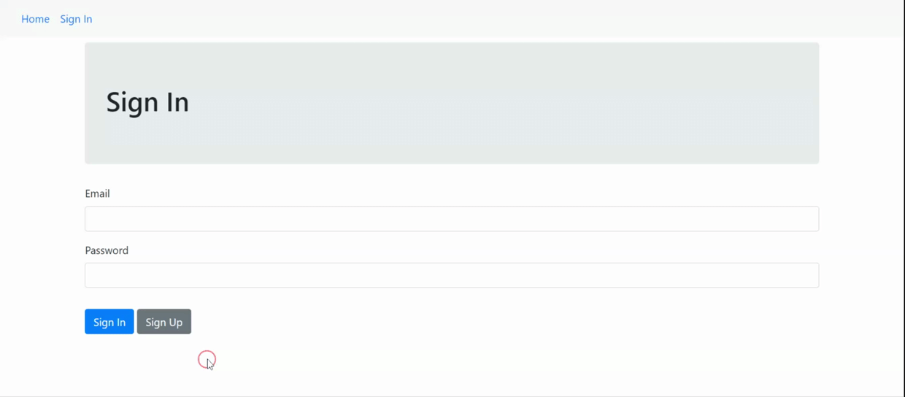

# Controller of Watched Series 
This software manages, stores and checks watched series, it was created as a part of Laravel training at [Alura](https://alura.com.br).  

## Features
This software there are some features to manage series and its characteristics, such as seasons and watched episodes. See the features below.

### Authentication
In this feature is possible to *sign in* or *sign up* from the system, you can to, create a user that can access all the series:



### Series Management
There are a CRUD, developed to manage series' data, such as their seasons and episodes


## Getting Started
These instructions will get you a copy of the project up and running on your local machine for development and testing purposes.

### Prerequisites
What things you need to do to run the software:

* PHP 7.3 or greater
* Composer 1.9.0  
* Laravel 5.8.38

### Installing and using
Follow the steps bellow to install and use the Series Control software:

1. Clone this repo with:
```bash 
  git clone https://github.com/matheusolivesilva/series-control.git
```
2. Download the dependencies running:
```bash
composer install
```

3. Run the software with Laravel Framework, simply run:
```bash
php artisan serve
```

	* If you have issues running Laravel built-in server, you can use PHP server by running:
```bash
php -S localhost:yourporthere -t public
```

## Running the Tests
Run the tests in command line using:
```bash
vendor/bin/phpunit
```
## Built With
* Laravel Framework
* VIM Editor
* PHP 7
* Gitflow
* Composer 

## Author
*Matheus Oliveira da Silva* - [Github](https://github.com/matheusolivesilva) | [Linkedin](https://www.linkedin.com/in/matheusoliveirasilva/)
